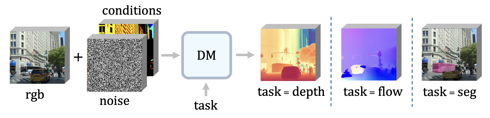
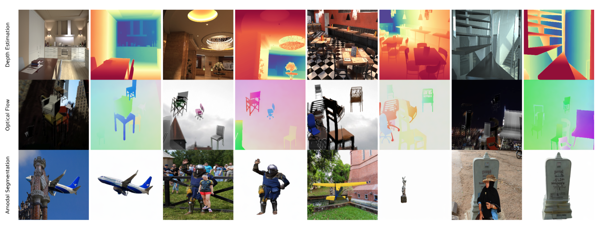

# Scaling Properties of Diffusion Models for Perceptual Tasks

### CVPR 2025

This repository is the official implementation of our [Scaling Properties of Diffusion Models for Perceptual Tasks](https://arxiv.org/abs/2411.08034).

[](https://arxiv.org/abs/2411.08034)&nbsp;
[](https://scaling-diffusion-perception.github.io/)
[](https://huggingface.co/zeeshanp/scaling_diffusion_perception)
[](https://www.apache.org/licenses/LICENSE-2.0)

[Rahul Ravishankar*](https://rravishankar1.github.io/),
[Zeeshan Patel*](https://www.zeeshanp.me/),
[Jathushan Rajasegaran](https://brjathu.github.io/),
[Jitendra Malik](https://people.eecs.berkeley.edu/~malik/)


In this paper, we argue that iterative computation with diffusion models offers a powerful paradigm for not only generation but also visual perception tasks. We unify tasks such as depth estimation, optical flow, and amodal segmentation under the framework of image-to-image translation, and show how diffusion models benefit from scaling training and test-time compute for these perceptual tasks. Through a careful analysis of these scaling properties, we formulate compute-optimal training and inference recipes to scale diffusion models for visual perception tasks. Our models achieve competitive performance to state-of-the-art methods using significantly less data and compute.



## Preparation

Create a conda environment and install dependencies:

```bash
conda create --name scaling-diffusion-perception python=3.12
conda activate scaling-diffusion-perception
pip install -r requirements.txt
```

Note: This codebase was tested with conda version 23.1.0.

### Model Weights

#### Download Our Model Weights
Our pretrained model weights can be downloaded from Hugging Face:

```bash
# Create directory for checkpoints if it doesn't exist
mkdir -p ckpts

# Download model weights
wget -O ckpts/dit_moe_generalist_fixed.pt https://huggingface.co/zeeshanp/scaling_diffusion_perception/resolve/main/dit_moe_generalist.pt
```

#### Download Stable-Diffusion-2 VAE
Our model uses the Stable-Diffusion-2 VAE. Download the checkpoint [here](https://huggingface.co/zeeshanp/scaling_diffusion_perception). Ensure the path to the stable-diffusion-2 directory is correctly specified in the `--path_to_sd` argument during inference.


### Dataset Setup

#### Full Datasets
Follow the instructions for each dataset:

1. **Depth Estimation**: Hypersim dataset
   - Follow the instructions at [Marigold's Hypersim preprocessing guide](https://github.com/prs-eth/Marigold/blob/main/script/dataset_preprocess/hypersim/README.md)

2. **Optical Flow**: Flying Chairs dataset
   - Follow the instructions at [Flying Chairs dataset page](https://lmb.informatik.uni-freiburg.de/resources/datasets/FlyingChairs.en.html)

3. **Amodal Segmentation**: Pix2Gestalt dataset
   - Follow the instructions at [Pix2Gestalt repository](https://github.com/cvlab-columbia/pix2gestalt?tab=readme-ov-file#dataset)

#### Toy Datasets
For quick experimentation without downloading the full datasets, we provide toy datasets with a few samples from each dataset:

- Located at `./toy_data` with the following structure:
  - `FlyingChairs_small/`: Small subset of Flying Chairs dataset
  - `Hypersim_small/`: Small subset of Hypersim dataset
  - `Pix2Gestalt_small/`: Small subset of Pix2Gestalt dataset

These toy datasets can be used for inference by modifying the `--data_path` argument to point to the appropriate toy dataset folder.

## Running Inference

### Depth Estimation

```bash
CUDA_VISIBLE_DEVICES=0 torchrun --nproc_per_node=1 --master_port=29520 run_inference.py \
            --config config/dit_moe_generalist.yaml \
            --output_dir /path/to/scaling-diffusion-perception/logs \
            --model_path /path/to/scaling-diffusion-perception/ckpts/dit_moe_generalist.pt \
            --model_type DiTMultiTaskMoE_uc \
            --job_name run_visualize \
            --num_exps 8 \
            --num_samples 3 \
            --num_steps 25 \
            --path_to_sd /path/to/Marigold/stable-diffusion-2/ \
            --task depth \
            --data_path /path/to/Hypersim_small/val/ \
            --data_ls /path/to/scaling-diffusion-perception/data_split/hysim_filename_list_val_filtered.txt \
            --color
```

### Amodal Segmentation

```bash
CUDA_VISIBLE_DEVICES=0 torchrun --nproc_per_node=1 --master_port=29520 run_inference.py \
            --config config/dit_moe_generalist.yaml \
            --output_dir /path/to/scaling-diffusion-perception/logs \
            --model_path /path/to/scaling-diffusion-perception/ckpts/dit_moe_generalist.pt \
            --model_type DiTMultiTaskMoE_uc \
            --job_name run_visualize \
            --num_exps 8 \
            --num_samples 1 \
            --num_steps 500 \
            --path_to_sd /path/to/Marigold/stable-diffusion-2/ \
            --task segment \
            --data_path /path/to/Pix2Gestalt_small/
```

### Optical Flow

```bash
CUDA_VISIBLE_DEVICES=0 torchrun --nproc_per_node=1 --master_port=29520 run_inference.py \
            --config config/dit_moe_generalist.yaml \
            --output_dir /path/to/scaling-diffusion-perception/logs \
            --model_path /path/to/scaling-diffusion-perception/ckpts/dit_moe_generalist.pt \
            --model_type DiTMultiTaskMoE_uc \
            --job_name run_visualize \
            --num_exps 8 \
            --num_samples 3 \
            --num_steps 250 \
            --path_to_sd /path/to/Marigold/stable-diffusion-2/ \
            --task flow \
            --data_path /path/to/FlyingChairs_small
```

## Results

We train a unified generalist model capable of performing depth estimation, optical flow estimation, and amodal segementation tasks. We apply all of our training and inference scaling techniques, highlighting the generalizability of our approach. Below are the results of our model:



## Citation

If you find this work useful, please cite our paper:

```bibtex
@misc{ravishankar2024scalingpropertiesdiffusionmodels,
      title={Scaling Properties of Diffusion Models for Perceptual Tasks}, 
      author={Rahul Ravishankar and Zeeshan Patel and Jathushan Rajasegaran and Jitendra Malik},
      year={2024},
      eprint={2411.08034},
      archivePrefix={arXiv},
      primaryClass={cs.CV},
      url={https://arxiv.org/abs/2411.08034}, 
}
```

## Contact

If you have any questions, please submit a GitHub issue!